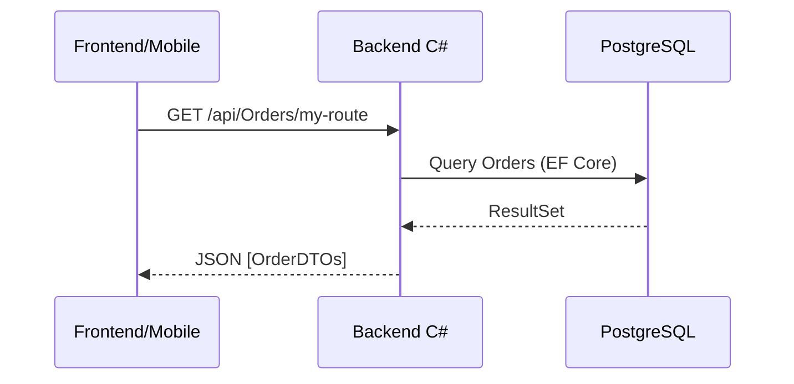
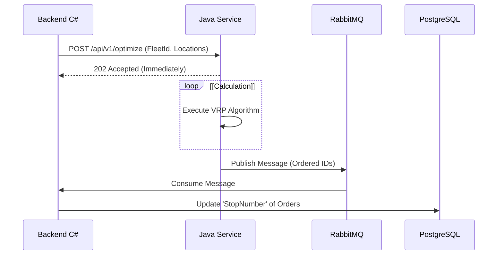

# Communication Diagram

Description of interactions between system components.

## Main Flows

### 1. High-Level Architecture

The system follows a hybrid microservices pattern, where core business logic resides in a .NET Backend, but computationally intensive tasks (VRP Optimization) are delegated to a specialized Java Service. Both share access to common infrastructure like RabbitMQ but maintain separate data responsibilities where possible.
```mermaid
graph TD
    User((User/Driver))
    Browser[Frontend SPA]
    Mobile[Mobile App]
    
    subgraph "Infrastructure"
        Proxy[Nginx Proxy Manager]
    end
    
    subgraph "Backend Services"
        DotNet[C# Backend API]
        Java[Java Optimization Service]
    end
    
    subgraph "Data and Messaging"
        DB[(PostgreSQL)]
        Rabbit[RabbitMQ]
        Cloud[Cloudinary / Azure Vision]
    end
    
    %% Flow
    User -->|HTTPS| Proxy
    Browser -->|HTTPS| Proxy
    Mobile -->|HTTPS| Proxy
    
    Proxy -->|Reverse Proxy| DotNet
    
    DotNet -->|EF Core / SQL| DB
    DotNet -->|HTTP POST (Optimize)| Java
    DotNet -->|API Call (Upload)| Cloud
    
    Java -.->|Publish Event| Rabbit
    Rabbit -.->|Consume Event| DotNet
```

### 2. Detailed Data Flows

#### Flow A: Frontend <-> C# Backend (Standard REST)

Standard Request/Response cycle for dashboard and mobile app data.

- **Protocol:** HTTP/1.1 (HTTPS)
- **Authentication:** JWT Bearer Token


#### Flow B: C# Backend <-> Java Microservice (Optimization)

Hybrid Synchronous/Asynchronous Pattern. C# requests optimization via HTTP, but results are processed asynchronously via RabbitMQ to avoid blocking.

- **Trigger:** C# asks Java to calculate the best route.
- **Processing:** Java executes VRP algorithms.
- **Result:** Java places ordered list in RabbitMQ; C# consumes it and updates DB.


#### Flow C: Services <-> Database

Direct connection using Entity Framework Core.

- **Connection:** TCP/5432
- **Pool:** Managed by Npgsql
```mermaid
graph LR
    API[C# Backend] -->|Read/Write| DB[(PostgreSQL Master)]
    Java[Java Service] -.->|Read Only (Optional)| DB
```
